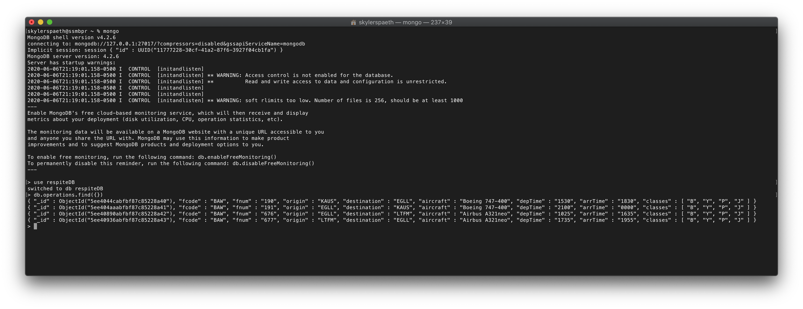

# respite
## About
Respite is a flight routing algorithm designed for application to single airlines or otherwise larger, aggregate travel sites. I am undertaking this project to teach myself more about algorithms and time/space complexity.

## Database Setup
In a read-only configuration, this project could work off a directory of JSON files... but that makes things significantly harder to scale. Respite instead uses mongoDB for database functionality and Mongoose for ODM. An identical structure must be present in your database for the code to be ran as expected.

To begin, populate your database accordingly:
 <!-- .element height="50%" width="50%" -->
Each of the entries in the `db.operations` collection should be a regularly scheduled flight that is operated by the carrier.
